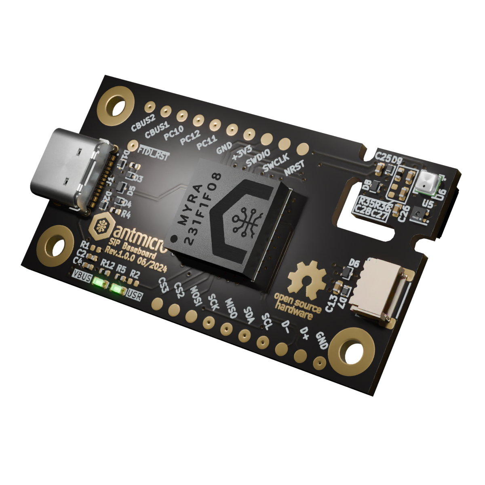

# Environment Sensor MYRA SiP Baseboard
Copyright (c) 2024 [Antmicro](https://www.antmicro.com/)

## Overview

This repository contains open hardware design files for Antmicro's Environment Sensor Board variant which includes the [MYRA SiP](https://github.com/antmicro/myra-sip) as well as temperature, pressure and humidity sensors.

The design files were prepared in KiCad 7.

## Key features

* Environment sensor SiP (with STM32G491REI6 MCU, 128kB FRAM, FTDI FT231XQ USB to UART converter)
* 50 mm x 26.5 mm PCB size
* USB-C Connector for data and power
* SHT45 temperature + humidity sensor:
	* typical relative humidity accuracy ±1% RH
	* operating relative humidity range 0-100% RH
	* typical temperature accuracy ±0.1°C
	* operating temperature range -40-125°C
* BME280 temperature + humidity + pressure sensor:
	* typical relative humidity accuracy ±3% RH
	* operating relative humidity range 10-100% RH
	* typical temperature accuracy ±1°C
	* operating temperature range -40-85°C
	* typical pressure accuracy ±1 hPa
	* operating pressure range 300-1100 hPa
* QWIIC Connectors
* RTC battery backup

## Repository structure

The main repository directory contains KiCad PCB project files, a LICENSE, and a README.
The remaining files are stored in the following directories:

* `doc` - contains board schematic
* `assets` - contains visual assets for showcasing this design on [Open Hardware Portal](https://openhardware.antmicro.com/boards/environment-sensor-sip-baseboard/?tab=features&view=top-ortho).

## Licensing
This project is published under the [Apache-2.0](https://github.com/antmicro/environment-sensor-sip-baseboard//blob/main/LICENSE) license.
